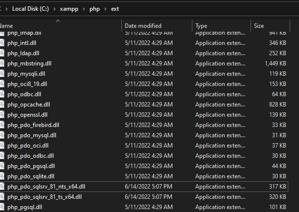

PHP project
Objetive: Realize CRUD basic sentences with php as backend

Install necessary plugins to programm on php
- PHP instelliSense
- PHP Debug

PHP DEBUG - steps
1. go to "xdebug installation wizard"
2. copy data info of your php from the main web localhost

2.1 then press ctrl+a to select all info and ctrl+c to copy to clipboard

3. Paste the php info into xdebug wizard field

4. Press button below "analyse my phpinfo() output", this will generate the next steps, just follow the steps..

5. in the PHP debug plugin this step work to me, copy to clipboard and paste to the php.ini file in the path of your xampp.. should be in the next path for default: c:/xampp/php/php.ini

6. for last step, go to the configuration from VS code.. file>preferences>settings and type "php validate", then click on settings.json and it will open the file content

7. the next property will be empty, put the path to php.exe, for example:

9. now, reload Apache from xampp control panel..
10. to create debug file, go to "run and debug" on VS code and create a launch.json file, the file will be created, just close it do not modify it

Add connection driver to php.ini to establish connection with SQLSERVER
1. Search in your browser "drivers for php for sql server"

2. download drivers

3. go to index php->PHPinfo to get the php version

4. depending on the php version copy & paste the dlls, check bits of your system as well, in this case php 8.1 -> pdo 81 files and 64bits version

5. copy in the next path c:/xampp/php/ext

6. go up one level folder c:/xampp/php and open php.ini file, and search the dlls declarations, in the next put the name of the drivers, for example:
extension=#name dll#

7. for last step, restart Apache(stop->start), then we verify the new PDO configuration, go to the PHPinfo again and these configuration should be displayed

